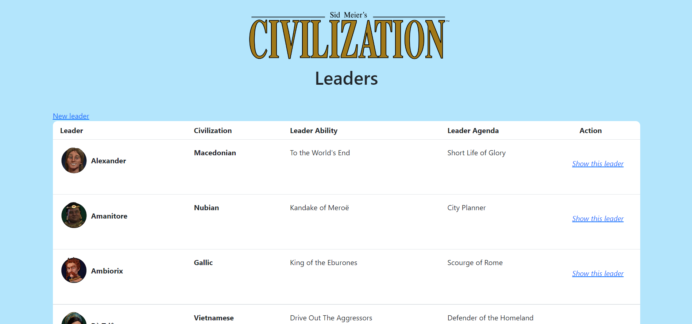
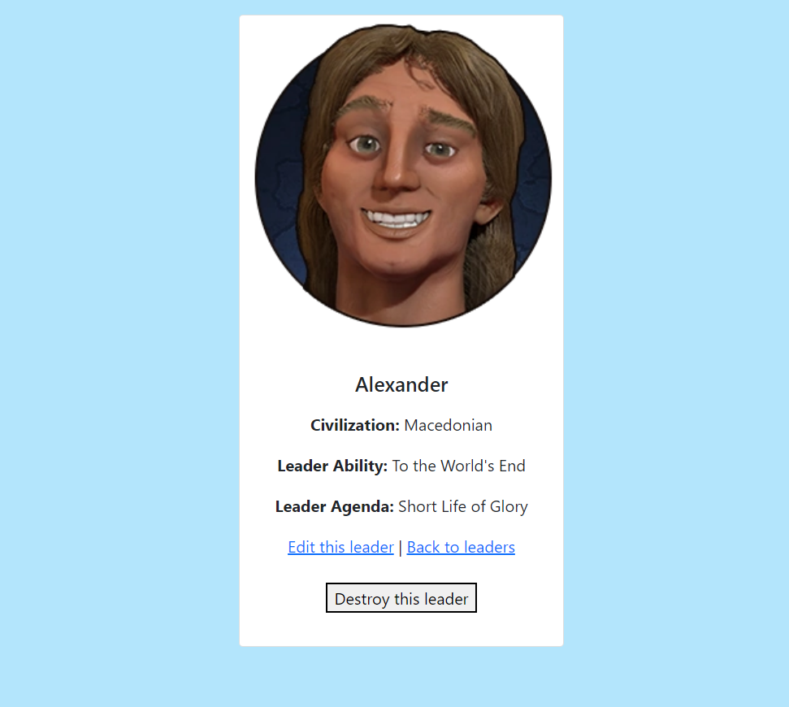

# CivLeader

CivLeader est une application développée en Ruby avec le framework Ruby on Rails qui permet la découverte et la gestion des personnages du jeu Civilization 6.

## Application Web
L'application est connecter a une base de données MongoDB.

L'application permet de créer, modifier et supprimer des personnages.

